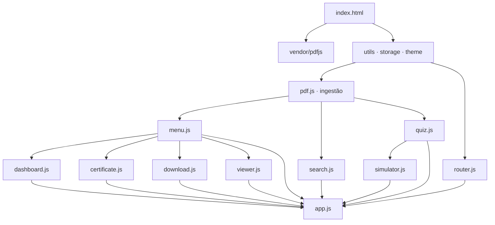

# Soft skills — plataforma de estudos

Plataforma web **100 % offline** que transforma um conjunto de apostilas em PDF em um treinamento navegável, com capítulos, exercícios gerados automaticamente, simulado, dashboard, certificado e visualizador integrado. Não há backend, banco de dados, framework SPA nem chamadas para CDN — todo o processamento acontece no navegador.

---

## Sumário

- [Visão geral](#visão-geral)
- [Como executar](#como-executar)
- [Estrutura de pastas](#estrutura-de-pastas)
- [Arquitetura](#arquitetura)
- [Pipeline de ingestão dos PDFs](#pipeline-de-ingestão-dos-pdfs)
- [Rotas](#rotas)
- [Módulos JavaScript](#módulos-javascript)
- [Estilos e temas](#estilos-e-temas)
- [Persistência local](#persistência-local)
- [Como funcionam os exercícios](#como-funcionam-os-exercícios)
- [Dashboard, ranking e gamificação](#dashboard-ranking-e-gamificação)
- [Certificado](#certificado)
- [Visualizador de PDF](#visualizador-de-pdf)
- [Adicionar/remover apostilas](#adicionarremover-apostilas)
- [Acessibilidade](#acessibilidade)
- [Restrições e boas práticas](#restrições-e-boas-práticas)
- [Solução de problemas](#solução-de-problemas)
- [Licença](#licença)

---

## Visão geral

- **Origem do conteúdo**: 8 PDFs colocados em [aulas/](aulas/) (mais um `manifest.json`).
- **Extração**: [PDF.js](https://mozilla.github.io/pdf.js/) empacotado localmente em [vendor/pdfjs/](vendor/pdfjs/) lê cada PDF em tempo de carregamento; a plataforma extrai texto, detecta títulos por tamanho de fonte e monta módulos + capítulos.
- **Interface**: shell fixo — sidebar 220 px com árvore de módulos e capítulos, header com busca global e alternador de tema, breadcrumb e área principal. Roteamento por hash (`#/rota`).
- **Recursos entregues**:
  - navegação por módulos e capítulos
  - busca global com destaque
  - visualizador de PDF inline com zoom e navegação por página
  - exercícios por capítulo (múltipla escolha, verdadeiro/falso, completar, associação, estudo de caso)
  - simulado com cronômetro, banco global e correção
  - dashboard com gráficos em Canvas (barras, linha, donut)
  - certificado com QR de validação e impressão (PDF via `window.print()`)
  - persistência total em `localStorage`, tema claro/escuro, ranking local, XP e sequência de estudos

Números do dataset atual: **8 apostilas → 62 capítulos → 505 questões geradas automaticamente**.

---

## Como executar

O projeto é uma página estática. Duas formas suportadas:

### 1. Servidor local (recomendado)

Qualquer servidor HTTP estático serve. Exemplo com Python:

```powershell
cd projeto_soft_skills_v2
python -m http.server 8123
```

Depois abra `http://localhost:8123/`.

Alternativas equivalentes: `npx serve`, `php -S localhost:8123`, extensão *Live Server* do VS Code etc.

### 2. Abrir direto o `index.html`

Funciona no **Firefox** (permite `fetch` de arquivos locais por padrão). No Chrome/Edge o `fetch` de `aulas/*.pdf` é bloqueado por política de origem para `file://` — nesse caso a aplicação exibe uma tela amigável instruindo a usar o servidor local ou o Firefox.

Nenhuma instalação, build ou dependência de rede é necessária.

---

## Estrutura de pastas

```
projeto_soft_skills_v2/
├── index.html                # shell da aplicação (sidebar + header + main)
├── README.md                 # este arquivo
├── assets/
│   └── favicon.svg
├── aulas/                    # PDFs originais + manifest
│   ├── manifest.json
│   └── *.pdf
├── css/
│   ├── style.css             # tokens de design + reset + tipografia
│   ├── layout.css            # shell (grid), sidebar, header, main
│   ├── components.css        # cards, badges, quiz, viewer, ranking…
│   ├── animations.css        # keyframes + reduced-motion
│   ├── dark.css              # overrides do tema escuro
│   └── responsive.css        # breakpoints 1024 / 768 / 480 + print
├── js/
│   ├── app.js                # orquestrador (bootstrap + rotas + home + capítulo)
│   ├── router.js             # roteador hash com parâmetros
│   ├── pdf.js                # ingestão dos PDFs + fetch binário
│   ├── menu.js               # sidebar (árvore + progresso + drawer mobile)
│   ├── search.js             # índice + busca com highlight
│   ├── quiz.js               # gerador e runner de exercícios por capítulo
│   ├── simulator.js          # simulado com timer e correção
│   ├── dashboard.js          # métricas + gráficos Canvas + ranking
│   ├── certificate.js        # emissão, QR-fingerprint e validação
│   ├── download.js           # grid de downloads
│   ├── viewer.js             # visualizador PDF inline com zoom
│   ├── theme.js              # alternador claro/escuro
│   ├── storage.js            # camada `localStorage` (namespace `ssp:`)
│   └── utils.js              # DOM builder, ícones, event bus, helpers
└── vendor/
    └── pdfjs/
        ├── pdf.min.js
        └── pdf.worker.min.js
```

---

## Arquitetura

Toda a lógica é **JavaScript ES2023 puro**, sem `import`/`export`. Cada arquivo em `js/` expõe um único namespace global (por exemplo `window.Quiz`, `window.Storage`). Os scripts são carregados no `<body>` em ordem de dependência.



**Bootstrap** (em [js/app.js](js/app.js) → `init()`):

1. `Theme.init()` aplica o tema salvo (ou `prefers-color-scheme`).
2. `Router.init()` prepara o roteador hash.
3. `PDFIngest.init(reportProgress)` — consulta cache; se ausente/desatualizado, executa a pipeline de extração dos PDFs.
4. `Menu.render()` monta a árvore de navegação e `Search.buildIndex()` cria o índice invertido em memória.
5. `registerRoutes()` associa cada rota a um handler.
6. `Router.start()` resolve a rota atual (padrão `#/`).
7. `Storage.registerStudyDay()` calcula sequência de dias e `startGlobalTimeTicker()` começa a contar tempo estudado a cada 30 s enquanto um capítulo estiver visível.

Comunicação entre módulos usa um **event bus** minimalista (`Utils.on/off/emit`) montado em um `<span>` interno.

---

## Pipeline de ingestão dos PDFs

Definida em [js/pdf.js](js/pdf.js). Executada uma única vez por versão do cache (`CACHE_VERSION`).

1. **Fetch** de `aulas/manifest.json` (fallback: lista fixa hardcoded).
2. Para cada PDF: `fetch → ArrayBuffer → pdfjsLib.getDocument({ data })`.
3. Por página, `getTextContent()` devolve *items* com posição (`x`, `y`), tamanho de fonte e peso; a partir daí:
   - **Agrupamento em linhas** por `(page, y)`.
   - **Detecção de corpo**: mediana dos tamanhos de fonte.
   - **Detecção de heading**: `fontSize >= mediaBody * 1.22`.
   - **Merge de headings** consecutivos na mesma página quebrados em várias linhas.
   - **Chapters**: gerados a partir dos headings H1/H2.
   - **Blocks**: por capítulo, cada bloco é `{type: 'p'|'h2'|'h3'|'list'|'code'|'callout', content}`.
   - **Callouts**: reconhecidos por prefixos (`Dica:`, `Importante:`, `Atenção:`, `Curiosidade:`, `Exemplo:`, `Erro:`, `Melhor prática:`).
   - **Sentence case**: títulos em CAPS/Title são convertidos preservando um conjunto de acrônimos (`AWS`, `GCP`, `API`, `PDF`, `QR`, `IA`, `SQL`, `HTML`, `CSS`, `JS`, `TS`, `CNV`, `CNPJ`, `RH`, `CEO`, `CTO`, `AI`).
4. Resultado (`state`) e a lista de módulos são armazenados em `localStorage` sob `ssp:pdf-cache`. O parâmetro `CACHE_VERSION` invalida o cache quando o pipeline muda.
5. `PDFIngest.refresh()` limpa o cache e reprocessa (útil ao trocar de apostilas).

---

## Rotas

Sintaxe: hash (`#/`) com parâmetros `:param`. Registradas em [js/app.js](js/app.js) → `registerRoutes()`.

| Rota                                          | Tela                                                            |
| --------------------------------------------- | --------------------------------------------------------------- |
| `#/`                                          | Home — métricas globais e grade de módulos                      |
| `#/dashboard`                                 | Dashboard com gráficos, ranking e histórico de simulados        |
| `#/downloads`                                 | Grade de cards por módulo (visualizar + baixar PDF)             |
| `#/visualizar/:mid`                           | Visualizador PDF inline, página 1                               |
| `#/visualizar/:mid/:page`                     | Visualizador PDF na página informada                            |
| `#/modulo/:mid`                               | Página do módulo (lista de capítulos)                           |
| `#/capitulo/:mid/:cid`                        | Leitura de capítulo (com `?q=` opcional para destacar termo)    |
| `#/capitulo/:mid/:cid/quiz`                   | Exercícios daquele capítulo                                     |
| `#/simulado`                                  | Configuração e execução do simulado geral                       |
| `#/certificado`                               | Certificado (emitido se aluno cumpre pré-requisitos)            |
| `#/certificado/validar/:code`                 | Validação local por código                                      |

Toda troca de rota emite `route:change` no event bus.

---

## Módulos JavaScript

### [js/utils.js](js/utils.js) — `window.Utils`
- `el(tag, props, ...children)` — DOM builder declarativo (aceita `class`, `html`, `text`, `dataset`, `onX`).
- `escapeHtml`, `escapeRegex`, `slugify`, `uid`, `clamp`, `pct`.
- `formatDuration`, `formatMMSS`, `formatDate`, `formatDateTime` (pt-BR).
- `shuffle`, `sample`, `pick`, `unique`, `debounce`.
- `toast`, `copyToClipboard`.
- Processamento de texto: `stripAccents`, `splitSentences`, `wordCount`, `cleanOcrText`, `highlightTerm`, `snippet`.
- Event bus: `on / off / emit`.
- `icon(name, size)` — SVG inline para {book, dashboard, chapter, quiz, simulator, certificate, download, home, check, arrow, caret, copy, search, info, warning, lightbulb}.

### [js/storage.js](js/storage.js) — `window.Storage`
- Prefixo `ssp:` para todas as chaves. Wrappers get/set com `JSON.parse` seguro.
- Chaves: `theme`, `progress`, `quizzes`, `simulations`, `certificates`, `profile`, `stats`, `ranking`, `pdf-cache`, `prefs`, `achievements`, `menu-open`.
- `addXP(amount, reason)` emite `xp:added`.
- `registerStudyDay()` gerencia streak comparando ISO date com o dia anterior.
- `getRanking()` semeia `[Ana, Bruno, Carla, Diego, Eva]` na primeira execução.
- `getMyRank()` mescla perfil com ranking e ordena.

### [js/theme.js](js/theme.js) — `window.Theme`
- Lê tema salvo ou `prefers-color-scheme`. Aplica atributo `data-theme` no `<html>`. Sincroniza `<meta name="theme-color">`.

### [js/router.js](js/router.js) — `window.Router`
- `Router.on(pattern, handler)` — compila `pattern` em regex com `:params`.
- `resolve()` faz match, chama handler, scroll para topo do main e emite `route:change`.

### [js/pdf.js](js/pdf.js) — `window.PDFIngest`
- Constantes: `DOCS_DIR = 'aulas/'`, `CACHE_VERSION`.
- `init(onProgress)`, `refresh()`, `getModule(mid)`, `getChapter(cid)`, `getAllChapters()`, `getModules()`.
- `fetchPdfBinary(file)` — retorna `ArrayBuffer` (usado por viewer.js).
- `renderPdfPage(file, page, scale)` — helper para renderização em canvas (viewer usa versão inline com controle de tarefa).

### [js/menu.js](js/menu.js) — `window.Menu`
- Renderiza a árvore da sidebar: **Início / Dashboard** → seção "Conteúdo" (módulos expansíveis) → **Simulado / Certificado / Downloads**.
- Persiste estado aberto/fechado por módulo em `ssp:menu-open`.
- `updateActive()` marca o item da rota atual e auto-expande o módulo pai.
- `updateGlobalProgress()` calcula concluídos vs. total e atualiza a barra de progresso no rodapé.
- `wireDrawer()` gerencia abrir/fechar no mobile (backdrop + botão hamburger).

### [js/search.js](js/search.js) — `window.Search`
- `buildIndex()` monta um índice plano com título, módulo, texto do capítulo.
- `query(term)` pontua resultados (título = 5, módulo = 2, texto = 1 + bônus por posição inicial).
- `wire()` conecta o `<input>` do header com `debounce` e renderiza cards `.search-result` com `<mark>`.

### [js/quiz.js](js/quiz.js) — `window.Quiz`
- `buildBank(chapter)` — cacheado por capítulo, gera 10–20 questões dos 5 tipos.
- `getMixedBank()` — banco global (usado pelo simulado).
- `renderChapterQuiz(chapter)` — UI em etapas com barra de progresso, botões **Confirmar** / **Pular**, tela final com métricas e review por questão, incluindo link "Revisar este assunto" com query `?q=`.
- Utilidades internas: `evaluate`, `shuffleOptions`, `extractTerms` (frequência + bigramas com stopwords em português), `pickDistractors`, `dedupQuestions`.

### [js/simulator.js](js/simulator.js) — `window.Simulator`
- `renderIntro()` — configura tamanho (30/40/50) e tempo (30/45/60 min).
- `start(n, seconds)` — inicia cronômetro; barra do timer ganha `is-warn` abaixo de 5 min e `is-danger` abaixo de 1 min.
- Fluxo salvar-e-avançar / voltar / finalizar. Ao terminar: métricas, agrupamento de erros por módulo (**tópicos fracos**) e review por questão com "Revisar este assunto".

### [js/dashboard.js](js/dashboard.js) — `window.Dashboard`
- 6 cards de métrica: capítulos concluídos, tempo estudado, média de acertos, nº de simulados, XP e streak.
- 3 gráficos em Canvas (sem lib): `drawModulesBar` (barras horizontais por módulo), `drawSimsLine` (histórico de simulados), `drawDonut` (percentual concluído). Todos com suporte a DPR e redimensionamento.
- Ranking com top 3 destacados.

### [js/certificate.js](js/certificate.js) — `window.Certificate`
- `render({code})` — se `code`, mostra tela de validação; senão avalia elegibilidade.
- `issueCertificate(profile, bestSim)` — gera código no formato `XXXX-XXXX-XXXX` (alfabeto sem `0/1/I/O/L`).
- `buildFingerprint(code)` — desenha em canvas 21×21 um "QR" determinístico (padrão hash + 3 olhos de canto). É apenas visual — não pretende ser escaneável.
- `renderValidation(main, code)` — busca o certificado no `localStorage` e exibe seus metadados.
- Botão **Imprimir** aciona `window.print()`; regras em `responsive.css` ocultam sidebar/header no `@media print`.

### [js/download.js](js/download.js) — `window.Download`
- Grade de `.download-card` com ícone, título, meta (páginas · capítulos), descrição, badge com o filename e dois botões: **Visualizar** (abre viewer) e **Baixar PDF** (link `download` direto para `aulas/*.pdf`).

### [js/viewer.js](js/viewer.js) — `window.Viewer`
- Renderiza cada página em `<canvas>` respeitando `devicePixelRatio` (até 2×).
- Controles: prev/next, spinbutton de página, zoom (− + Ajustar), atalhos **← →**.
- Fit-width automático; re-render em `resize` com debounce.
- Cancela `RenderTask` anterior e destrói o `PDFDocument` ao sair da rota.
- Sincroniza a URL com `history.replaceState` (não dispara o roteador).

### [js/app.js](js/app.js) — orquestrador
- `renderHome` (métricas + módulos).
- `renderChapter` (breadcrumb, badges, botões **Fazer exercícios** / **Marcar como concluído** / **Ver no PDF** / **PDF original**, blocos, prev/next entre capítulos).
- `renderBlocks` com destaque de termo por `<mark>` e `highlightCode` para blocos `code`.
- `startGlobalTimeTicker` — contabiliza tempo estudado apenas quando um capítulo está visível e o usuário não está ocioso >90 s.
- `showFatal(err)` — mensagem amigável mencionando Firefox e `python -m http.server`.

---

## Estilos e temas

Tokens de design ficam em [css/style.css](css/style.css):

```css
:root {
  --sidebar-w: 220px;
  --header-h: 60px;
  --radius-sm: 6px; --radius-md: 10px; --radius-lg: 14px;
  --sp-1..--sp-10: escala de espaçamento;
  --fs-xs..--fs-2xl: escala tipográfica;
  --accent: #4f46e5;
  --dur-fast: 120ms; --dur: 200ms; --ease: cubic-bezier(.4,.0,.2,1);
}
```

- **Layout**: [css/layout.css](css/layout.css) — grid `sidebar 220 px + workspace`. Header, breadcrumb e main empilhados em `grid-template-rows`. Main tem `overflow-y: auto` e conteúdo limitado a `max-width: 1180 px`.
- **Componentes**: [css/components.css](css/components.css) — cards, badges, quiz, callouts (`--tip`, `--important`, `--warning`, `--curiosity`, `--example`, `--error`, `--best`, `--info`), certificado, ranking, viewer.
- **Animações**: [css/animations.css](css/animations.css) — `spin`, `fade-in`, `slide-in-left`, `fade-in-backdrop`; respeita `@media (prefers-reduced-motion: reduce)`.
- **Tema escuro**: [css/dark.css](css/dark.css) — sobrescreve tokens sob `[data-theme="dark"]`, com toggle sun/moon.
- **Responsivo**: [css/responsive.css](css/responsive.css):
  - ≤ 1024 px reduz padding e certificado passa a 2 colunas.
  - ≤ 768 px transforma sidebar em drawer com backdrop (`transform: translateX(-100%)` / `.is-open`); hamburger no header.
  - ≤ 480 px: métricas em coluna única.
  - `@media print`: oculta sidebar/header/breadcrumb — só o corpo do certificado é impresso.

**Convenção editorial**: sentence case em toda a interface. Sem CAPS, sem Title Case. No máximo 2–3 cores de destaque por tela; cores com uso semântico (verde = sucesso, amarelo = atenção, vermelho = erro/perigo, cor primária apenas em ações principais).

---

## Persistência local

Toda a persistência é `localStorage` (com `sessionStorage` apenas para estado temporário do simulado). Chaves com prefixo `ssp:` — namespace acessível em `Storage.KEYS`.

| Chave                | Conteúdo                                                     |
| -------------------- | ------------------------------------------------------------ |
| `ssp:theme`          | `"light"` \| `"dark"`                                        |
| `ssp:progress`       | Map por capítulo: `{ completed, lastVisited, timeSec }`      |
| `ssp:quizzes`        | Histórico por capítulo com melhor score                       |
| `ssp:simulations`    | Array de simulados: `{ at, score, total, timeSec, percent }` |
| `ssp:certificates`   | Certificados emitidos indexados pelo código                  |
| `ssp:profile`        | `{ name, email, xp }`                                        |
| `ssp:stats`          | `{ studyDays: [ISO], streak, totalSec }`                     |
| `ssp:ranking`        | Ranking local (semeado)                                      |
| `ssp:pdf-cache`      | Cache do resultado da ingestão (`CACHE_VERSION`)              |
| `ssp:prefs`          | Preferências diversas                                        |
| `ssp:achievements`   | Conquistas desbloqueadas                                     |
| `ssp:menu-open`      | Estado aberto/fechado dos módulos na sidebar                 |

Limpar via DevTools ou executando `localStorage.clear()` restaura o estado inicial.

---

## Como funcionam os exercícios

O gerador vive em [js/quiz.js](js/quiz.js) → `buildBank(chapter)`. Ele opera sobre os *blocks* extraídos do PDF do capítulo:

1. **Extração de termos**: tokeniza texto, remove *stopwords* pt-BR, aplica frequência + bigramas. Guarda um `terms[]` ordenado por peso.
2. **Sentenças candidatas**: `Utils.splitSentences` (20–320 caracteres, sem colar quebras).
3. **Tipos gerados**:
   - **Multiple choice (mcq)** — sentença com termo blank + 3 distratores (termos de outros capítulos).
   - **True/False (tf)** — sentença original ou com termo trocado por sinônimo/distrator.
   - **Fill in the blank (fill)** — sentença com blank e termo esperado; comparação normalizada (`stripAccents` + `toLowerCase`).
   - **Match (associação)** — 3–4 pares termo ↔ trecho.
   - **Case (estudo de caso)** — cenário curto com 4 alternativas em texto corrido.
4. **Deduplicação** pelo prefixo do prompt.
5. **Correção**: `evaluate(q, ans)` cobre os 5 formatos; alternativas embaralhadas por questão.

`getMixedBank()` concatena bancos de todos os capítulos (usado pelo simulado).

Ao final de um quiz o usuário vê métricas, gabarito por questão e o link **Revisar este assunto** (`#/capitulo/:mid/:cid?q=<termo>`), abrindo o capítulo com o termo destacado por `<mark>`.

---

## Dashboard, ranking e gamificação

- **XP**: `Storage.addXP(amount, reason)`. Concluir capítulo = 15 XP; simulado aprovado atribui XP adicional.
- **Streak**: `registerStudyDay()` compara a data atual com a última em ISO. Reset se a diferença for > 1 dia.
- **Ranking**: array local de 5 personagens semeados + o usuário. Ordenação por XP. Top 3 recebe destaque visual.
- **Gráficos**:
  - Barras horizontais por módulo (concluídos/total).
  - Linha temporal do desempenho em simulados.
  - Donut geral de conclusão.

Todos os gráficos redimensionam com o container e respeitam DPR até 2×.

---

## Certificado

Regras de elegibilidade:

1. Ter concluído todos os capítulos **ou**
2. Ter feito um simulado com aproveitamento ≥ 70 % (`bestSim.percent >= 70`).

Ao passar, `issueCertificate()` gera:

- **Código**: `XXXX-XXXX-XXXX` (alfabeto sem `0`, `1`, `I`, `O`, `L`).
- **QR fingerprint**: 21×21 em canvas com 3 olhos de canto e padrão determinístico a partir do hash do código. Apenas visual — a validação real é feita pela rota `#/certificado/validar/:code` procurando o código em `ssp:certificates`.
- **Impressão**: botão **Imprimir** aciona `window.print()`. O `@media print` em [css/responsive.css](css/responsive.css) oculta o shell da aplicação — só o corpo do certificado sai na página.

---

## Visualizador de PDF

Implementado em [js/viewer.js](js/viewer.js). Características:

- Toolbar sticky com **prev/next**, spinbutton de página, **zoom (− +)**, **Ajustar** (fit-width) e link **Baixar**.
- Renderização em canvas com `devicePixelRatio` para nitidez retina (clampa em 2×).
- Cancelamento seguro: uma nova troca de página cancela a `RenderTask` anterior e usa um `renderToken` incremental para evitar corrida.
- **Atalhos**: setas **←** / **→**.
- **Deep-link**: `#/visualizar/:mid/:page` — atualizado via `history.replaceState` para não disparar o roteador em cada navegação.
- **Ver no PDF** aparece em cada capítulo, já apontando para `chapter.pageStart`.
- Ao sair da rota, o documento PDF.js é `destroy()`-ado e a memória liberada.

---

## Adicionar/remover apostilas

1. Copie os PDFs para [aulas/](aulas/).
2. Atualize [aulas/manifest.json](aulas/manifest.json) com a lista de nomes.
3. Recarregue a página com o cache do navegador limpo (Ctrl + F5) **ou** rode no console:

    ```js
    PDFIngest.refresh().then(() => location.reload());
    ```

Nenhum código de layout ou lógica precisa ser tocado — `Menu.render()` reconstrói a sidebar dinamicamente. Caso o pipeline de ingestão seja alterado, incremente `CACHE_VERSION` em [js/pdf.js](js/pdf.js) para invalidar todas as instalações antigas.

---

## Acessibilidade

- Skip link `Pular para o conteúdo` no topo.
- `:focus-visible` com contorno accent em todos os elementos interativos.
- Papéis ARIA em landmarks (`role="banner"`, `role="search"`, `nav[aria-label]`), toolbar do viewer com `role="toolbar"`, gráficos com `aria-live` no texto que os acompanha.
- `aria-current="page"` no item ativo da sidebar.
- Suporte a `prefers-reduced-motion`.
- Alvos de toque ≥ 40 × 40 px em mobile.
- Textos, cores e estados testados com contraste AA em ambos os temas.

---

## Restrições e boas práticas

Do escopo original do projeto:

- **Permitido**: HTML5, CSS3, JavaScript ES2023 puro.
- **Proibido**: React, Angular, Vue, Node, backend, banco de dados, frameworks SPA, CDNs em runtime.
- **Execução**: abrir `index.html` (ou servidor estático local).
- **Persistência**: exclusivamente `localStorage` / `sessionStorage`.
- **Layout**: fechado (sidebar 220 px + header + main), sem alterações no shell entre telas.
- **Editorial**: sentence case em toda a interface.

---

## Solução de problemas

| Sintoma                                                | Causa                                                        | Solução                                              |
| ------------------------------------------------------ | ------------------------------------------------------------ | ---------------------------------------------------- |
| Tela de erro "Não foi possível carregar os PDFs"       | Aberto direto pelo Chrome/Edge; `fetch(file://)` bloqueado    | Usar Firefox **ou** subir `python -m http.server`    |
| Menu ou capítulos aparecem em CAPS                     | Cache antigo                                                 | Ctrl + F5, ou `PDFIngest.refresh()` no console       |
| Novo PDF não aparece na sidebar                        | Não incluído no `manifest.json` ou cache antigo              | Atualizar manifest e limpar cache                    |
| PDF pixelado no visualizador                           | Zoom acima de 300 % ou monitor com DPR > 2                   | Toolbar → **Ajustar** para voltar ao fit-width       |
| Certificado sai com sidebar ao imprimir                | CSS de print sobrescrito por extensão de tema                | Desabilitar extensão ou usar navegador limpo         |
| localStorage cheio (raro)                              | Muitos históricos de simulado                                | `Storage.clearAll()` no console (será apagado tudo)  |

Logs úteis:

```js
PDFIngest.getModules();      // módulos + capítulos parseados
Storage.getSimulations();    // histórico de simulados
Storage.getProgress();       // progresso por capítulo
Storage.getMyRank();         // posição atual no ranking
```

---

## Licença

Código do projeto sob licença MIT. As apostilas em [aulas/](aulas/) permanecem sob a licença/uso dos seus respectivos autores — este repositório apenas as consome como material didático. PDF.js (em [vendor/pdfjs/](vendor/pdfjs/)) é distribuído sob Apache License 2.0.
